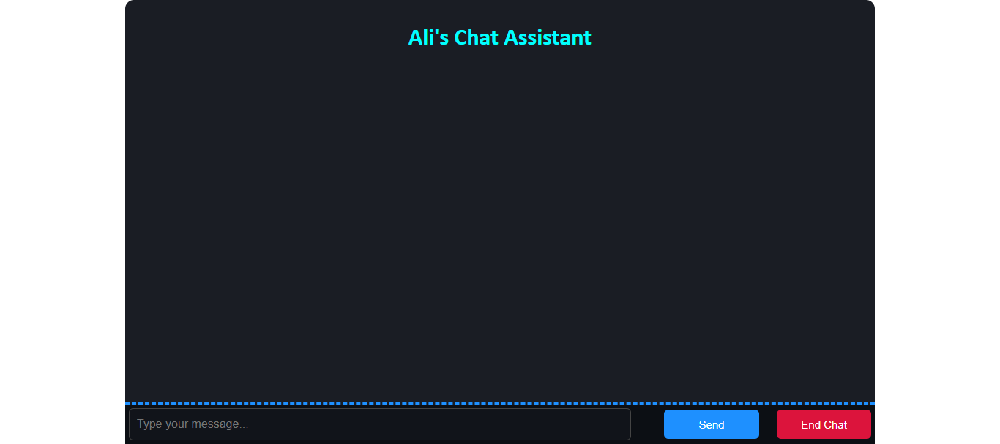
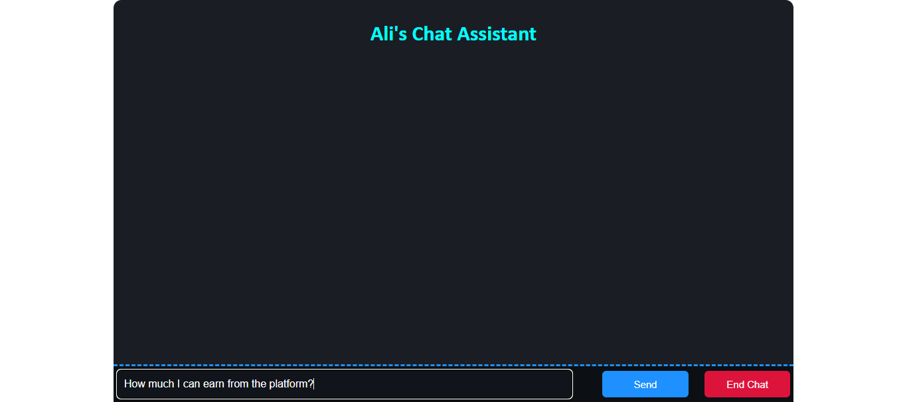
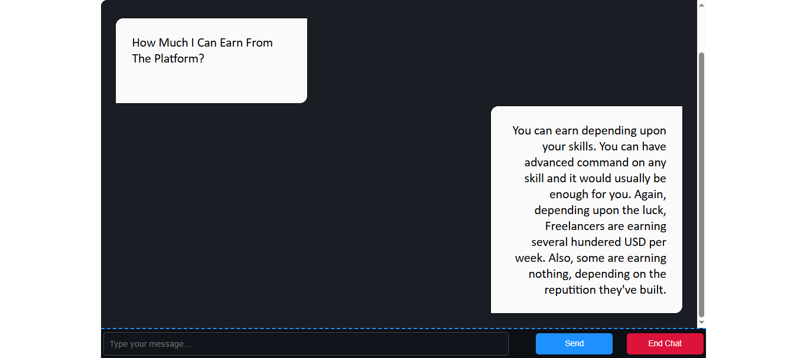
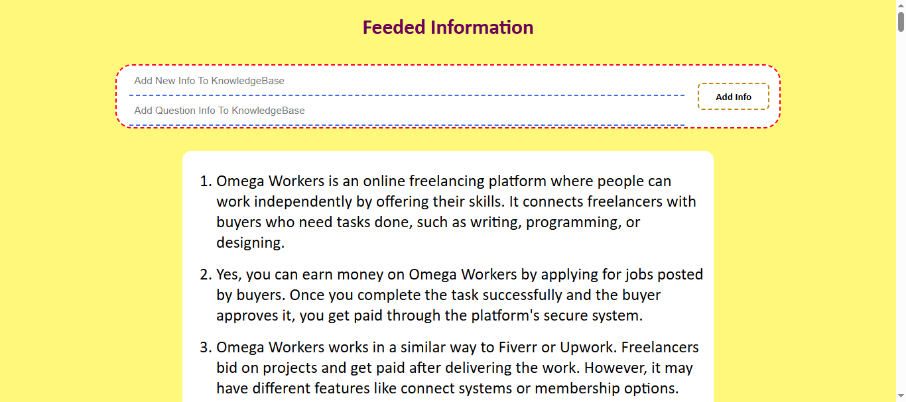
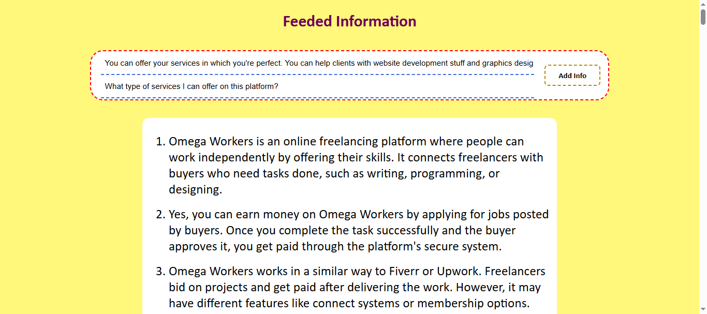
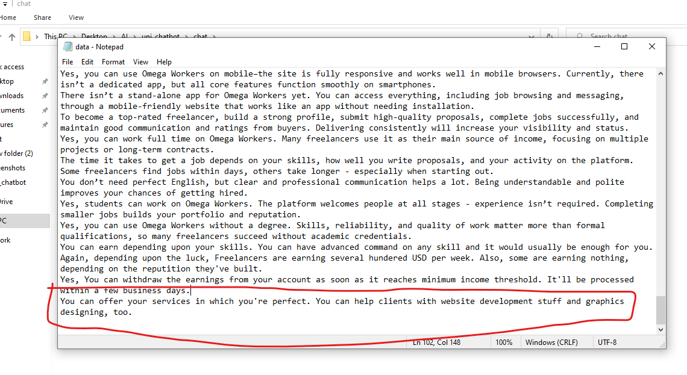
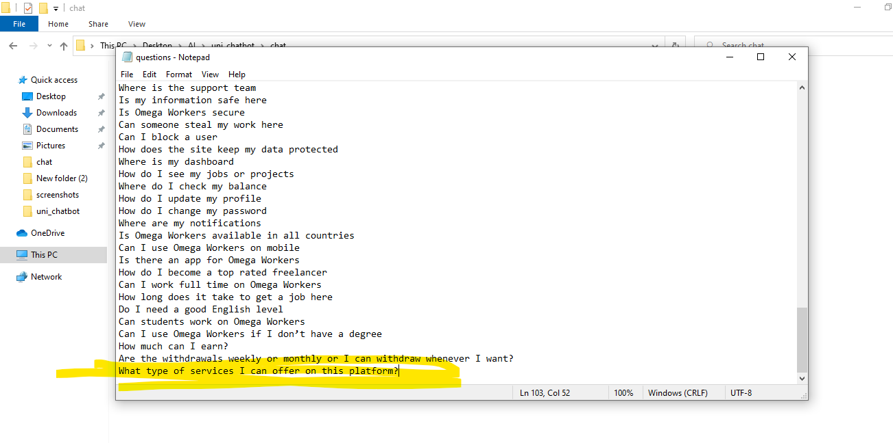

# 💬 AI Chat Assistant

A simple AI-powered chatbot using Flask and Sentence Transformers. It responds to user queries by matching them semantically with a local knowledge base.

---

## 🚀 Features

- Semantic search using `sentence-transformers`
- Custom Q&A entries via admin panel
- Basic web interface with Flask
- Stores chats and data in `.txt` files

---

## 📸 Demo

> ⚠️ Deployment not available due to resource limits.  
> 👉 **Screenshots and local demo included below.**

  

  

  



---

## 🔧 Setup

```bash
git clone https://github.com/MAliRaffayMirza/ChatBot-TransformerBased/
cd chat-assistant
pip install -r requirements.txt
python chat.py
```

App runs at: [http://127.0.0.1:5000](http://127.0.0.1:5000)

---

## 🧾 Requirements

```txt
flask
torch
sentence-transformers
```

---

## 📂 Project Structure

```
├── chat.py
├── data.txt
├── question.txt
├── iframe.txt
├── requirements.txt
├── Procfile
├── Screenshots
    ├── 1
    ├── 2
    ├── 3
    ├── 4
    ├── 5
    ├── 6
    └── 7
└── README.md
```

---

## 🚫 Why Not Deployed?

Due to memory limits on free hosting (512MB+ required), deployment is not available.  
Project can be deployed on:
- VPS with 1GB+ RAM
- Hugging Face (Gradio version)
- Replit Hacker plan or paid Render tier

---

## 📄 License

[MIT License](LICENSE)

---

## 👤 Author

**Muhammad Ali Raffay**  
[GitHub](https://github.com/MAliRaffayMirza)
